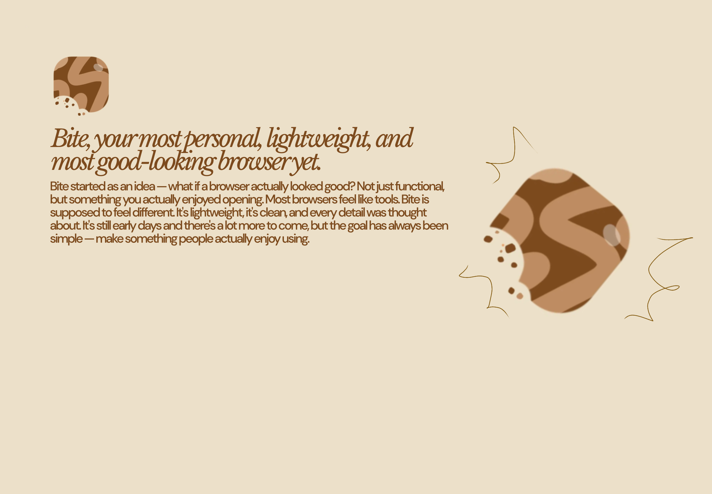

# Bite Browser

### Bite into something better.

---

> **Bite is currently in beta.**
> Some things are still being worked on. Expect the occasional rough edge.

---

## Still in beta

**Proxy browsing** — lets you actually load real websites inside the app by routing them through a server, bypassing the restrictions that would normally block them.

**Ad & tracker blocker** — scans pages for known ad networks and tracking scripts and removes them so pages load cleaner and your activity stays private.

**Find on page** — lets you search for any word or phrase on the page you're currently viewing, highlights every match, and lets you jump between them.

**Dark mode injector** — forces any website into dark mode even if the site doesn't support it natively, easier on the eyes at night.

**Custom CSS injector** — lets you write your own styling rules and apply them to any website, so you can change fonts, colors, layouts — whatever you want.

**Screenshot tool** — saves a full image of the current page directly to your device.

**Split screen** — lets you open two websites side by side at the same time.

**Offline page saving** — saves a full copy of a page to your device so you can read it later without an internet connection.

**Video speed controller** — lets you speed up or slow down any video or audio playing on a page.

**Translate page** — detects the language of the current page and redirects it through Google Translate into whatever language you choose.

---

## Finished & working

**Themes & accent colors** — choose from a range of color themes and accent colors to make the browser look exactly how you want it.

**Private browsing mode** — opens a dark, isolated session that doesn't save your history, cookies, or any activity from that session.

**Bookmarks & reading list** — save pages you want to come back to, or add them to a reading list for later.

**History** — keeps track of every page you've visited so you can find anything you've already been to.

**Downloads** — lets you download files from the web directly to your device and tracks everything you've saved.

**Notes & to-do list** — a built-in scratchpad and task list so you can jot things down without leaving the app.

**Password manager** — stores your usernames and passwords and can autofill them when you revisit a site.

**Tab management** — open multiple tabs at once, switch between them, and close them from a full screen tab view.

**Weather widget** — shows the current weather on your home screen based on your location.

**Privacy stats** — tracks how many ads, trackers, and sessions have been blocked across your browsing.

**Reader mode** — strips away all the clutter from articles and gives you just the text in a clean, readable format.

**Quick access shortcuts** — a row of your favorite sites on the home screen so you can get anywhere in one tap.

**Search engine selection** — choose between DuckDuckGo, Google, Brave Search, and Bing as your default search engine.

**QR code generator** — generates a scannable QR code for whatever page you're currently on, so you can share it instantly.

---

## Download

Grab the latest beta APK from the [Releases](../../releases) page.

---

*Bite — no fluff, just fast.*
